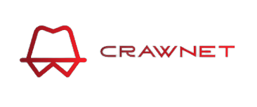
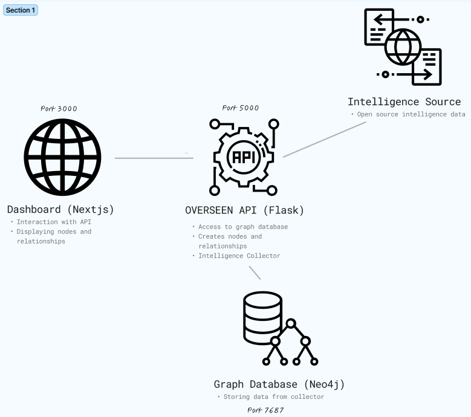

<br />
<div align="center">
  <a href="https://github.com/cryxnet/crawnet">
    
  </a>

  <h3 align="center">CRAWNET</h3>

  <p align="center">
CRAWNET is a graph-based domain discovery tool that helps you gather information
about domains and potential relationships with other actors.
With the power of graph databases, we can find and display quickly information and relationship with other actors, to identify threats before they happen and much more.
    <br />
    <a href="https://github.com/cryxnet/crawnet"><strong>Explore the docs »</strong></a>
    <br />
    <br />
    <a href="https://github.com/cryxnet/crawnet/issues">Report Bug</a>
    ·
    <a href="https://github.com/cryxnet/crawnet/issues">Request Feature</a>
        ·
    <a href="https://github.com/cryxnet/crawnet/security/policy">Report Vulnerability</a>
  </p>
</div>

## Installation

To install the project and its dependencies, follow these steps:

**Make sure you have docker installed!**

1. Clone the repository to your local machine:

```bash
git clone https://github.com/cryxnet/crawnet.git
```

2. Go to the directory

```bash
cd crawnet
```

3. Rename (to `.env`) and edit the [configuration file](/sample.env)

```bash
mv sample.env .env
&& sed -i 's/NEO4J_PASSWORD=CHANGEME/NEO4J_PASSWORD=your_password_here/' .env \
&& sed -i 's/FLASK_APP_URL=http:\/\/CHANGEME:5000/FLASK_APP_URL=http:\/\/your_machine_ip_or_localhost:5000/' .env \
&& sed -i 's/FLASK_DEBUG=1/FLASK_DEBUG=0/' .env
```

4. Start the docker stack

```bash
docker compose -f docker-compose.prod.yaml up
```

## Roadmap

**v1**

-   [x] First Version Release

**v2**

-   [ ] Collectors Handling (Easy to add new intelligence and entity nodes)
-   [ ] Relationship detection & connection engine (Database engine that automatically connects nodes if they have anything in common together)
-   [ ] Threat Intelligence Data
-   [ ] Better UI/UX

## Intelligence Data

The Intelligence Service is using the following sources:

-   [Cert Fingerprint | CRT.SH](https://crt.sh/)
-   [IP Information | IPAPI.CO](https://ipapi.co/IPADDRESS/json/)
-   [Python | WHOIS](https://pypi.org/project/python-whois/)

### Subdomains

To get gather subdomains from a domain we use technique like google dorks and certifcate fingerprinting.

## Architecture



-   For the dashboard we use [Next.js](https://nextjs.org/) with the [MUI](https://mui.com/), [vis-data](https://www.npmjs.com/package/vis-data) and [vis-network](https://www.npmjs.com/package/vis-network) libraries to display the nodes and interaction with the api (we also use other libraries).
-   For the API we use the Flask framework for python.
-   For the database we use the graph database [Neo4j](https://neo4j.com/)

## Testing

-   We have a pipeline that is automatically testing the [intergration](/tests/integration.py) between the 3 services and source code for any vulnerabilities

| Test Case                 | Expected Outcome                                                                        | Outcome                                                                                                                                                             |
| ------------------------- | --------------------------------------------------------------------------------------- | ------------------------------------------------------------------------------------------------------------------------------------------------------------------- |
| Reach Website             | Response status code is 200 and "Success" is printed to console                         | [](https://github.com/cryxnet/crawnet/actions/workflows/testing.yml) |
| Reach API                 | Response status code is 200 or 404 and "Success" is printed to console                  | [](https://github.com/cryxnet/crawnet/actions/workflows/testing.yml) |
| Reach Neo4j               | Neo4j connection is successful and "Success" is printed to console                      | [](https://github.com/cryxnet/crawnet/actions/workflows/testing.yml) |
| API-Website Communication | Response status code is 200 and "Success" is printed to console                         | [](https://github.com/cryxnet/crawnet/actions/workflows/testing.yml) |
| API-Neo4j Communication   | Response JSON is {'nodes': [], 'relationships': []} and "Success" is printed to console | [](https://github.com/cryxnet/crawnet/actions/workflows/testing.yml) |
| Vulnerable Python Code    | Nothing Found                                                                           |                                                                                     |
| Vulnerable TS Code        | Nothing Found                                                                           |                                                                                     |

### Local Testing

```bash
python tests/intergration.py
```

## Security Policy

-   Please take a moment to review and familiarize yourself with our [security policy](/SECURITY.md).
-   We encourage you to report any issues, bugs, or vulnerabilities that you encounter while using our service.
-   Your help in identifying and reporting any security issues or vulnerabilities is greatly appreciated. Please refer to our [security policy](/SECURITY.md) for guidance.

## Disclaimer

YOUR USAGE OF THIS PROJECT CONSTITUTES YOUR AGREEMENT TO THE FOLLOWING TERMS:

    THE MISUSE OF THE DATA PROVIDED BY THIS PROJECT MAY LEAD TO CRIMINAL CHARGES AGAINST THE PERSONS CONCERNED.

    I DO NOT TAKE ANY RESPONSIBILITY FOR THE CASE. USE THIS PROJECT ONLY FOR RESEARCH PURPOSES, EDUCATIONAL PURPOSES & ETHICAL ONLY.

    CRAWNET is a project related to Computer Security and for Educational Purposes and not a project that promotes illegal activities.

    Don't use this Project for any illegal activities.

    If something happens, we do not take any liability.

    CRAWNET should be considered as a project for educational purposes.

## Author

Created by [cryxnet](https://cryxnet.com/)

If you find this project helpful, please give it a ⭐️ on GitHub to show your support.
I would also appreciate it if you shared it with others who might find it useful!
